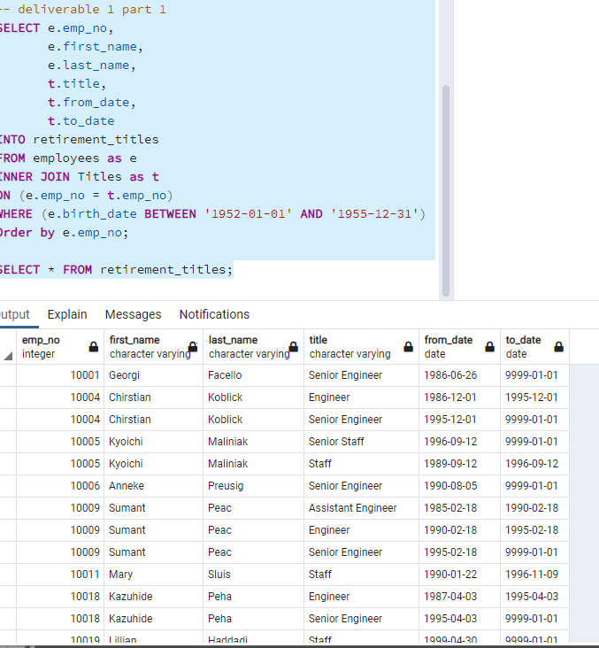
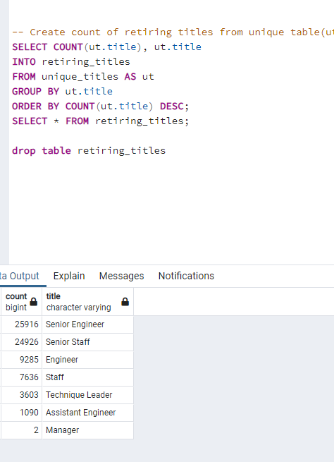
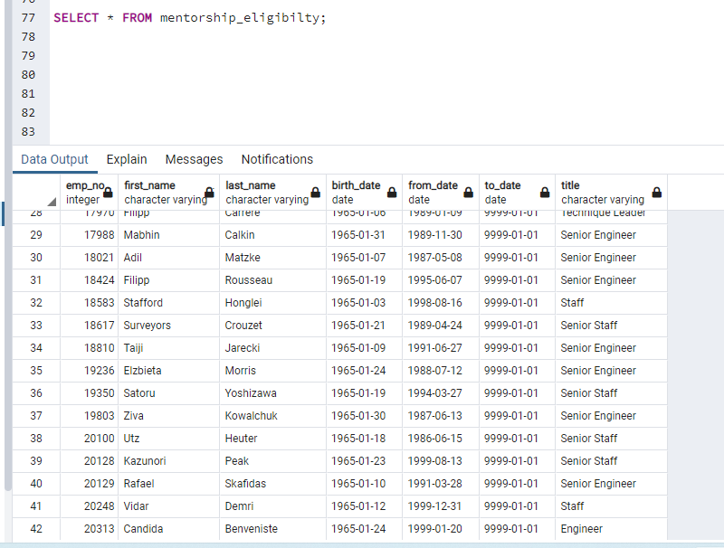
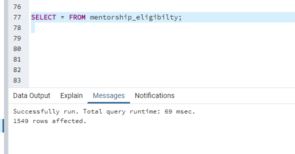

# Pewlett-Hackard-Analysis
# Overview of the analysis
### To detemine the number of retiring  employees per title and and identify employees who are eligible to participate in a           mentorship program.
# Results
### With the retirment_titles table we were  able to see all  eligible employees for retirement and how long they have worked at each position over the course of their career and received  many duplicates due having multiple positions.

### The unique titles table that we created is showing the most recent title for employees of retirement age.

### Number of retirement-age employees by most recent job title was created using Count function which returened a potential amount of retirees.

###Then figured out the  employees who are eligible to participate in a mentorship program,which returned a list of 1549 employees.

# Summary
##How many roles will need to be filled as the "silver tsunami" begins to make an impact?
###The "silver tsunami" will have a significant impact of leaving 90,398 vacancies.

##Are there enough qualified, retirement-ready employees in the departments to mentor the next generation of Pewlett Hackard employees?
### There is a significant amount of mentors there.

